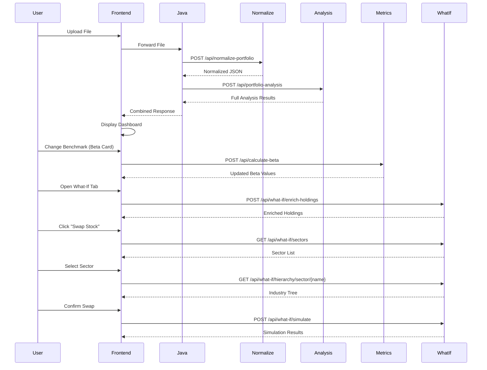

# Portfolio Analytics Application - Production API Documentation

## Executive Summary

This document provides a **complete reference guide** for all backend APIs currently being consumed by the frontend application. This is intended for your colleagues to understand the full API landscape before pushing to production.

---

## Application Architecture

```mermaid
graph LR
    A[User Upload] --> B[Java Wrapper]
    B --> C[/api/normalize-portfolio]
    C --> D[Normalized JSON]
    D --> E[/api/portfolio-analysis]
    E --> F[Frontend Dashboard]
    F --> G[Dynamic Metric APIs]
    F --> H[Graph Generation APIs]
    F --> I[What-If Simulation APIs]
```

### Current Architecture Flow:

1. **User uploads transaction file** → Java wrapper sends to normalization endpoint
2. **Normalization API** (`/api/normalize-portfolio`) → Returns standardized JSON
3. **Portfolio Analysis API** (`/api/portfolio-analysis`) → Processes normalized data
4. **Frontend** → Consumes analysis results + calls additional specialized endpoints

---

## 🔴 Core Portfolio APIs

### 1. **Normalize Portfolio**

**Endpoint:** `POST /api/normalize-portfolio`

**Purpose:** Converts broker-specific transaction files (CSV/Excel) into standardized JSON format

**Request:**

```http
POST http://localhost:8000/api/normalize-portfolio
Content-Type: multipart/form-data

file: [UploadFile] (CSV, XLS, or XLSX)
```

**Response:**

```json
[
  {
    "universal_trade_id": "HIDDEN",
    "Symbol": "RELIANCE",
    "Scrip_Name": "RELIANCE INDUSTRIES LTD",
    "Trade_execution_time": "2024-01-01 10:00:00",
    "Order_Type": "B",
    "Qty": 10.0,
    "Mkt_Price": 2500.0,
    "Amount": 25000.0,
    "Exchange": "NSE",
    "Series": "EQ",
    "ISIN": "INE002A01018",
    "Intraday_Flag": false
  }
]
```

**Used by Frontend:**

- **File:** `PortfolioDashboard.jsx` (line 298)
- **Function:** `handleUpload()` - STEP 1 of upload flow
- **Call Count:** Once per file upload

---

### 2. **Portfolio Analysis (Light API)**

**Endpoint:** `POST /api/portfolio-analysis`

**Purpose:** Main analysis engine - calculates portfolio metrics, ledger, valuation, graphs, etc.

**Request:**

```http
POST http://localhost:8000/api/portfolio-analysis
Content-Type: application/json

{
  "transactions": [
    // Normalized transaction objects from /api/normalize-portfolio
  ]
}
```

**Response Structure:**

```json
{
  "status": "success",
  "portfolio_summary": {
    "total_deployed_amount": 250000.0,
    "current_market_value": 280000.0,
    "total_unrealized_pnl": 30000.0,
    "total_realized_pnl": 15000.0,
    "best_performer": {
      "symbol": "TCS",
      "unrealized_pnl": 12000
    },
    "worst_performer": {
      "symbol": "INFY",
      "unrealized_pnl": -3000
    }
  },
  "ledger": {
    "holdings": [
      {
        "Symbol": "TCS",
        "qty": 10,
        "current_price": 3500,
        "avg_buy_price": 3200,
        // ... more fields
      }
    ],
    "transactions": [...],
    "closed_positions": [...]
  },
  "valuation_metrics": {
    "portfolio_metrics": {
      "pe": 25.4,
      "pb": 3.2,
      "dividend_yield": 1.5
    },
    "individual_metrics": {
      "TCS": {
        "pe": 28.5,
        "pb": 4.1,
        "price": 3500,
        "eps": 122.8,
        "quarter": "202312"
      }
    }
  },
  "beta_metrics": {
    "daily_betas": {
      "portfolio_beta": 1.15,
      "individual": {
        "TCS": {
          "beta": 1.2,
          "correlation": 0.85,
          "stock_volatility": 0.25,
          "market_volatility": 0.18
        }
      }
    },
    "monthly_betas": { /* similar structure */ },
    "benchmark": "Nifty 50"
  },
  "alpha_metrics": {
    "portfolio_alpha": 0.0345,
    "individual_alphas": {
      "TCS": {
        "alpha": 0.042,
        "actual_return": 0.18,
        "expected_return": 0.138,
        "beta_used": 1.2
      }
    },
    "risk_free_rate": 0.0662,
    "benchmark": "Nifty 50"
  },
  "ratio_metrics": {
    "portfolio_metrics": {
      "sharpe_ratio": 1.45,
      "sortino_ratio": 1.82,
      "treynor_ratio": 8.5,
      "information_ratio": 0.65,
      "omega_ratio": 1.35,
      "hhi": 0.18,
      "volatility": 0.22,
      "downside_volatility": 0.14
    },
    "individual_metrics": {
      "TCS": {
        "sharpe_ratio": 1.6,
        "sortino_ratio": 2.1,
        "treynor_ratio": 9.2,
        "information_ratio": 0.7,
        "annual_return": 0.18,
        "volatility": 0.25,
        "downside_volatility": 0.15,
        "beta": 1.2,
        "active_return": 0.05
      }
    },
    "benchmark": "Nifty 50",
    "risk_free_rate": 0.0662
  },
  "graphs": {
    "top_performing": { /* graph data */ },
    "portfolio_health": { /* graph data */ },
    // ... other pre-generated graphs
  },
  "news": {
    "articles": [...]
  }
}
```

**Used by Frontend:**

- **File:** `PortfolioDashboard.jsx` (line 311)
- **Function:** `handleUpload()` - STEP 2 of upload flow
- **Call Count:** Once per file upload
- **Data Flow:** Results stored in `data` state → passed to child components

---

## 🟢 Portfolio News API

### 3. **Portfolio News**

**Endpoint:** `POST /api/news/portfolio-news`

**Purpose:** Fetch news articles for portfolio symbols

**Request:**

```http
POST http://localhost:8000/api/news/portfolio-news
Content-Type: application/json

{
  "symbols": ["TCS", "INFY", "RELIANCE"],
  "date": "15-01-2026",  // Optional: DD-MM-YYYY format
  "max_articles": 60
}
```

**Response:**

```json
{
  "articles": [
    {
      "symbol": "TCS",
      "headline": "TCS announces Q3 results",
      "content": "...",
      "date": "2026-01-15",
      "source": "...",
      "url": "..."
    }
  ],
  "metadata": {
    "total_count": 45,
    "symbols_covered": ["TCS", "INFY", "RELIANCE"]
  }
}
```

**Used by Frontend:**

- **File:** `PortfolioDashboard.jsx` (line 386)
- **Function:** `fetchNewsForDate()`
- **Call Count:**
  - Once on initial load (if news not in main API response)
  - On-demand when user selects a date filter
- **Component:** `NewsSheet` tab in dashboard

---

## 🔵 Dynamic Metric Calculation APIs

### 4. **Calculate Beta**

**Endpoint:** `POST /api/calculate-beta`

**Purpose:** Recalculate portfolio & individual stock betas with custom benchmark

**Request:**

```http
POST http://localhost:8000/api/calculate-beta
Content-Type: application/json

{
  "current_holdings": [
    {
      "symbol": "TCS",
      "quantity": 10,
      "current_price": 3500
    }
  ],
  "benchmark": "Nifty Bank"  // User-selected benchmark
}
```

**Response:**

```json
{
  "status": "success",
  "beta_metrics": {
    "daily_betas": {
      "portfolio_beta": 1.25,
      "individual": {
        "TCS": {
          "beta": 1.3,
          "correlation": 0.82,
          "covariance": 0.0045,
          "market_variance": 0.0035,
          "stock_volatility": 0.28,
          "market_volatility": 0.19
        }
      }
    },
    "monthly_betas": {
      /* similar */
    },
    "benchmark": "Nifty Bank"
  }
}
```

**Used by Frontend:**

- **File:** `BetaCard.jsx` (line 121)
- **Function:** `handleBenchmarkChange()`
- **Call Count:** Every time user changes benchmark dropdown
- **UI Component:** Beta Card modal - benchmark selector

---

### 5. **Calculate Alpha**

**Endpoint:** `POST /api/calculate-alpha`

**Purpose:** Recalculate Jensen's Alpha with custom benchmark

**Request:**

```http
POST http://localhost:8000/api/calculate-alpha
Content-Type: application/json

{
  "current_holdings": [
    {
      "symbol": "TCS",
      "quantity": 10,
      "current_price": 3500
    }
  ],
  "benchmark": "Nifty IT"
}
```

**Response:**

```json
{
  "status": "success",
  "alpha_metrics": {
    "portfolio_alpha": 0.038,
    "individual_alphas": {
      "TCS": {
        "alpha": 0.045,
        "actual_return": 0.19,
        "expected_return": 0.145,
        "beta_used": 1.25,
        "risk_free_rate": 0.0662
      }
    },
    "risk_free_rate": 0.0662,
    "benchmark": "Nifty IT"
  }
}
```

**Used by Frontend:**

- **File:** `AlphaCard.jsx` (line 58)
- **Function:** `handleBenchmarkChange()`
- **Call Count:** Every time user changes benchmark
- **UI Component:** Alpha Card modal

---

### 6. **Calculate Ratios**

**Endpoint:** `POST /api/calculate-ratios`

**Purpose:** Recalculate Sharpe, Sortino, Treynor, Information Ratio, Omega with custom benchmark

**Request:**

```http
POST http://localhost:8000/api/calculate-ratios
Content-Type: application/json

{
  "current_holdings": [
    {
      "symbol": "TCS",
      "quantity": 10,
      "current_price": 3500
    }
  ],
  "benchmark": "Nifty 50"
}
```

**Response:**

```json
{
  "status": "success",
  "ratio_metrics": {
    "portfolio_metrics": {
      "sharpe_ratio": 1.52,
      "sortino_ratio": 1.95,
      "treynor_ratio": 8.8,
      "information_ratio": 0.68,
      "omega_ratio": 1.42,
      "hhi": 0.17,
      "volatility": 0.21,
      "downside_volatility": 0.13,
      "annual_return": 0.16
    },
    "individual_metrics": {
      "TCS": {
        /* per-stock ratios */
      }
    },
    "benchmark": "Nifty 50",
    "risk_free_rate": 0.0662
  }
}
```

**Used by Frontend:**

- **File:** `MetricsCard.jsx` (line 217)
- **Function:** `handleBenchmarkChange()`
- **Call Count:** Every benchmark change
- **UI Component:** Portfolio Metrics Card

---

## 📊 On-Demand Graph Generation API

### 7. **Generate Single Graph**

**Endpoint:** `POST /api/graph/{graph_id}`

**Purpose:** Generate individual portfolio graphs on-demand (lazy loading)

**Supported Graph IDs:**

- `top_performing`
- `portfolio_health`
- `swot_analysis`
- `risk_return`
- `combined_box_plot`
- `trade_pnl_plot`
- `underwater_plot`
- `correlation_plot`
- `trade_behavior`
- `best_trade_prob`
- `industry_sunburst`

**Request:**

```http
POST http://localhost:8000/api/graph/correlation_plot
Content-Type: multipart/form-data

file: [UploadFile]
fd_rate: 0.07        // Optional: for SWOT analysis
mf_rate: 0.15        // Optional: for SWOT analysis
inflation_rate: 0.06 // Optional: for SWOT analysis
```

**Response:**

```json
{
  "status": "success",
  "graph_data": {
    // Plotly figure JSON
    "data": [...],
    "layout": {...}
  },
  "insights": {
    "summary": "Your portfolio shows...",
    "key_points": [...]
  },
  "metadata": {
    "title": "Correlation Analysis",
    "description": "...",
    "generated_at": "2026-01-16T10:42:00"
  }
}
```

**Used by Frontend:**

- **File:** `GraphCatalog.jsx` (line 253)
- **Function:** `loadGraph()`
- **Call Count:** Once per graph when user clicks to view
- **UI:** Graph Catalog grid → Full-screen graph modal

---

## 🔄 What-If Simulation APIs (NEW)

### 8. **Enrich Holdings with Sector Data**

**Endpoint:** `POST /api/what-if/enrich-holdings`

**Purpose:** Add sector, industry, hierarchy metadata to holdings

**Request:**

```http
POST http://localhost:8000/api/what-if/enrich-holdings
Content-Type: application/json

{
  "holdings": [
    {
      "symbol": "TCS",
      "quantity": 10,
      "current_price": 3500,
      "name": "Tata Consultancy Services"
    }
  ]
}
```

**Response:**

```json
{
  "holdings": [
    {
      "symbol": "TCS",
      "quantity": 10,
      "current_price": 3500,
      "name": "Tata Consultancy Services",
      "sector": "Information Technology",
      "industry": "IT - Software"
    }
  ]
}
```

**Used by Frontend:**

- **File:** `WhatIfDashboard.jsx` (line 76)
- **Function:** Initial data loading (IIFE in useEffect)
- **Call Count:** Once on What-If tab mount
- **Purpose:** Populate sector allocation pie charts

---

### 9. **Get All Sectors**

**Endpoint:** `GET /api/what-if/sectors`

**Purpose:** Fetch list of all available sectors for browsing

**Request:**

```http
GET http://localhost:8000/api/what-if/sectors
```

**Response:**

```json
[
  "Banking",
  "Information Technology",
  "Pharmaceuticals",
  "Automobiles",
  "Energy"
]
```

**Used by Frontend:**

- **File:** `WhatIfDashboard.jsx` (line 109)
- **Function:** `fetchAllSectors()`
- **Call Count:** When user clicks "Change Sector" or opens stock picker modal
- **UI:** Sector grid in stock selection modal

---

### 10. **Get Sector Hierarchy**

**Endpoint:** `GET /api/what-if/hierarchy/sector/{sector_name}`

**Purpose:** Get industries and stocks within a sector

**Request:**

```http
GET http://localhost:8000/api/what-if/hierarchy/sector/Information%20Technology
```

**Response:**

```json
{
  "sector": "Information Technology",
  "peers_by_sector": {
    "Information Technology": {
      "IT - Software": [
        {
          "symbol": "TCS",
          "name": "Tata Consultancy Services",
          "current_price": 3500
        },
        {
          "symbol": "INFY",
          "name": "Infosys Limited",
          "current_price": 1450
        }
      ],
      "IT - Consulting": [...]
    }
  }
}
```

**Used by Frontend:**

- **File:** `WhatIfDashboard.jsx` (line 127)
- **Function:** `handleSectorSelect()`
- **Call Count:** When user clicks a sector card
- **UI:** Industry expansion panels in modal

---

### 11. **Get Stock Sector Hierarchy**

**Endpoint:** `GET /api/what-if/sector-hierarchy/{symbol}`

**Purpose:** Get sector/industry hierarchy for a specific stock

**Request:**

```http
GET http://localhost:8000/api/what-if/sector-hierarchy/TCS
```

**Response:**

```json
{
  "sector": "Information Technology",
  "industry": "IT - Software",
  "symbol": "TCS",
  "peers_by_sector": {
    "Information Technology": {
      "IT - Software": [
        { "symbol": "INFY", "name": "...", "current_price": 1450 }
      ]
    }
  }
}
```

**Used by Frontend:**

- **Files:**
  - `WhatIfDashboard.jsx` (line 149) - Global search
  - `WhatIfDashboard.jsx` (line 188) - When swapping a holding
- **Function:** `handleGlobalSearch()` and swap initialization
- **Call Count:**
  - When user searches for a stock by symbol
  - When user clicks "Swap" on existing holding

---

### 12. **Execute What-If Simulation**

**Endpoint:** `POST /api/what-if/simulate`

**Purpose:** Run full Monte Carlo simulation with portfolio changes

**Request:**

```http
POST http://localhost:8000/api/what-if/simulate
Content-Type: application/json

{
  "current_holdings": [
    {
      "symbol": "TCS",
      "quantity": 10,
      "current_price": 3500
    }
  ],
  "source_symbol": "TCS",      // Stock to sell/reduce
  "target_symbol": "INFY",     // Stock to buy/add
  "action": "swap",            // "swap" | "add" | "remove"
  "quantity": 5.0,             // Shares to swap
  "amount": 17500.0,           // Optional: rupee amount
  "current_metrics": {         // Current portfolio metrics from main dashboard
    "sharpe_ratio": 1.45,
    "sortino_ratio": 1.82,
    // ...
  }
}
```

**Response:**

```json
{
  "status": "success",
  "modified_holdings": [
    {
      "symbol": "TCS",
      "quantity": 5,
      "current_price": 3500
    },
    {
      "symbol": "INFY",
      "quantity": 12,
      "current_price": 1458
    }
  ],
  "projected_metrics": {
    "hhi": 0.16,
    "sector_allocation": {
      "Information Technology": 0.85,
      "Banking": 0.15
    }
  },
  "comparison": {
    "current": {
      "hhi": 0.18,
      "diversification_score": 7.2
    },
    "projected": {
      "hhi": 0.16,
      "diversification_score": 7.8
    },
    "delta": {
      "hhi": -0.02,
      "diversification_score": 0.6
    }
  },
  "insights": {
    "recommendation": "This swap improves diversification...",
    "key_changes": [...]
  }
}
```

**Used by Frontend:**

- **File:** `WhatIfDashboard.jsx` (line 222)
- **Function:** `handleSimulate()`
- **Call Count:** When user confirms swap action
- **UI:** What-If Analysis results panel

---

## 📋 API Summary Table

| #   | Endpoint                                 | Method | Called By            | Purpose                | Frequency              |
| --- | ---------------------------------------- | ------ | -------------------- | ---------------------- | ---------------------- |
| 1   | `/api/normalize-portfolio`               | POST   | `PortfolioDashboard` | Normalize broker files | Once per upload        |
| 2   | `/api/portfolio-analysis`                | POST   | `PortfolioDashboard` | Main analysis          | Once per upload        |
| 3   | `/api/news/portfolio-news`               | POST   | `PortfolioDashboard` | Fetch news             | On load + date changes |
| 4   | `/api/calculate-beta`                    | POST   | `BetaCard`           | Recalc beta            | Per benchmark change   |
| 5   | `/api/calculate-alpha`                   | POST   | `AlphaCard`          | Recalc alpha           | Per benchmark change   |
| 6   | `/api/calculate-ratios`                  | POST   | `MetricsCard`        | Recalc metrics         | Per benchmark change   |
| 7   | `/api/graph/{graph_id}`                  | POST   | `GraphCatalog`       | Generate graphs        | Per graph view         |
| 8   | `/api/what-if/enrich-holdings`           | POST   | `WhatIfDashboard`    | Add sector data        | Once on mount          |
| 9   | `/api/what-if/sectors`                   | GET    | `WhatIfDashboard`    | List sectors           | On modal open          |
| 10  | `/api/what-if/hierarchy/sector/{sector}` | GET    | `WhatIfDashboard`    | Get sector stocks      | Per sector click       |
| 11  | `/api/what-if/sector-hierarchy/{symbol}` | GET    | `WhatIfDashboard`    | Get stock hierarchy    | Search + swap init     |
| 12  | `/api/what-if/simulate`                  | POST   | `WhatIfDashboard`    | Run simulation         | Per swap action        |

---

## 🌐 Complete CURL Command Examples

### 1. Normalize Portfolio

```bash
# Upload a CSV file for normalization
curl -X POST http://localhost:8000/api/normalize-portfolio \
  -F "file=@/path/to/your/transactions.csv"
```

```bash
# Upload an Excel file
curl -X POST http://localhost:8000/api/normalize-portfolio \
  -F "file=@/path/to/your/transactions.xlsx"
```

---

### 2. Portfolio Analysis (Light API)

```bash
curl -X POST http://localhost:8000/api/portfolio-analysis \
  -H "Content-Type: application/json" \
  -d '{
    "transactions": [
      {
        "universal_trade_id": "HIDDEN",
        "Symbol": "TCS",
        "Scrip_Name": "TATA CONSULTANCY SERVICES LTD",
        "Trade_execution_time": "2024-01-15 10:30:00",
        "Order_Type": "B",
        "Qty": 10.0,
        "Mkt_Price": 3500.0,
        "Amount": 35000.0,
        "Exchange": "NSE",
        "Series": "EQ",
        "ISIN": "INE467B01029",
        "Intraday_Flag": false
      },
      {
        "universal_trade_id": "HIDDEN",
        "Symbol": "INFY",
        "Scrip_Name": "INFOSYS LIMITED",
        "Trade_execution_time": "2024-02-10 14:20:00",
        "Order_Type": "B",
        "Qty": 20.0,
        "Mkt_Price": 1450.0,
        "Amount": 29000.0,
        "Exchange": "NSE",
        "Series": "EQ",
        "ISIN": "INE009A01021",
        "Intraday_Flag": false
      }
    ]
  }'
```

---

### 3. Portfolio News

```bash
# Fetch news for portfolio symbols (default: today)
curl -X POST http://localhost:8000/api/news/portfolio-news \
  -H "Content-Type: application/json" \
  -d '{
    "symbols": ["TCS", "INFY", "RELIANCE"],
    "max_articles": 60
  }'
```

```bash
# Fetch news for a specific date
curl -X POST http://localhost:8000/api/news/portfolio-news \
  -H "Content-Type: application/json" \
  -d '{
    "symbols": ["TCS", "WIPRO", "HDFCBANK"],
    "date": "15-01-2026",
    "max_articles": 50
  }'
```

---

### 4. Calculate Beta

```bash
# Recalculate beta with default benchmark (Nifty 50)
curl -X POST http://localhost:8000/api/calculate-beta \
  -H "Content-Type: application/json" \
  -d '{
    "current_holdings": [
      {
        "symbol": "TCS",
        "quantity": 10,
        "current_price": 3500
      },
      {
        "symbol": "INFY",
        "quantity": 20,
        "current_price": 1450
      }
    ],
    "benchmark": "Nifty 50"
  }'
```

```bash
# Calculate beta against Nifty Bank
curl -X POST http://localhost:8000/api/calculate-beta \
  -H "Content-Type: application/json" \
  -d '{
    "current_holdings": [
      {
        "symbol": "HDFCBANK",
        "quantity": 15,
        "current_price": 1620
      },
      {
        "symbol": "ICICIBANK",
        "quantity": 25,
        "current_price": 980
      }
    ],
    "benchmark": "Nifty Bank"
  }'
```

---

### 5. Calculate Alpha

```bash
# Calculate Jensen's Alpha with Nifty 50
curl -X POST http://localhost:8000/api/calculate-alpha \
  -H "Content-Type: application/json" \
  -d '{
    "current_holdings": [
      {
        "symbol": "TCS",
        "quantity": 10,
        "current_price": 3500
      },
      {
        "symbol": "WIPRO",
        "quantity": 50,
        "current_price": 420
      }
    ],
    "benchmark": "Nifty 50"
  }'
```

```bash
# Calculate alpha against Nifty IT
curl -X POST http://localhost:8000/api/calculate-alpha \
  -H "Content-Type: application/json" \
  -d '{
    "current_holdings": [
      {
        "symbol": "TCS",
        "quantity": 10,
        "current_price": 3500
      },
      {
        "symbol": "INFY",
        "quantity": 20,
        "current_price": 1450
      },
      {
        "symbol": "WIPRO",
        "quantity": 30,
        "current_price": 420
      }
    ],
    "benchmark": "Nifty IT"
  }'
```

---

### 6. Calculate Ratios

```bash
# Calculate Sharpe, Sortino, Treynor, Information Ratio, Omega
curl -X POST http://localhost:8000/api/calculate-ratios \
  -H "Content-Type: application/json" \
  -d '{
    "current_holdings": [
      {
        "symbol": "TCS",
        "quantity": 10,
        "current_price": 3500
      },
      {
        "symbol": "RELIANCE",
        "quantity": 8,
        "current_price": 2450
      },
      {
        "symbol": "HDFCBANK",
        "quantity": 12,
        "current_price": 1620
      }
    ],
    "benchmark": "Nifty 50"
  }'
```

---

### 7. Generate Single Graph

```bash
# Generate correlation plot
curl -X POST http://localhost:8000/api/graph/correlation_plot \
  -F "file=@/path/to/your/transactions.csv"
```

```bash
# Generate SWOT analysis with custom rates
curl -X POST http://localhost:8000/api/graph/swot_analysis \
  -F "file=@/path/to/your/transactions.csv" \
  -F "fd_rate=0.07" \
  -F "mf_rate=0.15" \
  -F "inflation_rate=0.06"
```

```bash
# Generate top performing stocks graph
curl -X POST http://localhost:8000/api/graph/top_performing \
  -F "file=@/path/to/your/transactions.csv"
```

```bash
# Generate portfolio health graph
curl -X POST http://localhost:8000/api/graph/portfolio_health \
  -F "file=@/path/to/your/transactions.csv"
```

```bash
# Generate risk-return matrix
curl -X POST http://localhost:8000/api/graph/risk_return \
  -F "file=@/path/to/your/transactions.csv"
```

```bash
# Generate combined box plot
curl -X POST http://localhost:8000/api/graph/combined_box_plot \
  -F "file=@/path/to/your/transactions.csv"
```

```bash
# Generate trade P&L plot
curl -X POST http://localhost:8000/api/graph/trade_pnl_plot \
  -F "file=@/path/to/your/transactions.csv"
```

```bash
# Generate underwater plot
curl -X POST http://localhost:8000/api/graph/underwater_plot \
  -F "file=@/path/to/your/transactions.csv"
```

```bash
# Generate trade behavior analysis
curl -X POST http://localhost:8000/api/graph/trade_behavior \
  -F "file=@/path/to/your/transactions.csv"
```

```bash
# Generate best trade probability
curl -X POST http://localhost:8000/api/graph/best_trade_prob \
  -F "file=@/path/to/your/transactions.csv"
```

```bash
# Generate industry sunburst
curl -X POST http://localhost:8000/api/graph/industry_sunburst \
  -F "file=@/path/to/your/transactions.csv"
```

---

### 8. Enrich Holdings with Sector Data

```bash
curl -X POST http://localhost:8000/api/what-if/enrich-holdings \
  -H "Content-Type: application/json" \
  -d '{
    "holdings": [
      {
        "symbol": "TCS",
        "quantity": 10,
        "current_price": 3500,
        "name": "Tata Consultancy Services"
      },
      {
        "symbol": "RELIANCE",
        "quantity": 8,
        "current_price": 2450,
        "name": "Reliance Industries Limited"
      },
      {
        "symbol": "HDFCBANK",
        "quantity": 15,
        "current_price": 1620,
        "name": "HDFC Bank Limited"
      }
    ]
  }'
```

---

### 9. Get All Sectors

```bash
# Simple GET request to fetch all available sectors
curl -X GET http://localhost:8000/api/what-if/sectors
```

---

### 10. Get Sector Hierarchy

```bash
# Get all industries and stocks in Information Technology sector
curl -X GET "http://localhost:8000/api/what-if/hierarchy/sector/Information%20Technology"
```

```bash
# Get all industries and stocks in Banking sector
curl -X GET "http://localhost:8000/api/what-if/hierarchy/sector/Banking"
```

```bash
# Get all industries and stocks in Pharmaceuticals sector
curl -X GET "http://localhost:8000/api/what-if/hierarchy/sector/Pharmaceuticals"
```

```bash
# Get all industries and stocks in Energy sector
curl -X GET "http://localhost:8000/api/what-if/hierarchy/sector/Energy"
```

---

### 11. Get Stock Sector Hierarchy

```bash
# Get sector/industry info and peers for TCS
curl -X GET http://localhost:8000/api/what-if/sector-hierarchy/TCS
```

```bash
# Get sector/industry info and peers for RELIANCE
curl -X GET http://localhost:8000/api/what-if/sector-hierarchy/RELIANCE
```

```bash
# Get sector/industry info and peers for HDFCBANK
curl -X GET http://localhost:8000/api/what-if/sector-hierarchy/HDFCBANK
```

---

### 12. Execute What-If Simulation

```bash
# Swap action: Sell 5 shares of TCS, buy equivalent INFY
curl -X POST http://localhost:8000/api/what-if/simulate \
  -H "Content-Type: application/json" \
  -d '{
    "current_holdings": [
      {
        "symbol": "TCS",
        "quantity": 10,
        "current_price": 3500
      },
      {
        "symbol": "RELIANCE",
        "quantity": 8,
        "current_price": 2450
      }
    ],
    "source_symbol": "TCS",
    "target_symbol": "INFY",
    "action": "swap",
    "quantity": 5.0,
    "amount": 17500.0,
    "current_metrics": {
      "sharpe_ratio": 1.45,
      "sortino_ratio": 1.82,
      "treynor_ratio": 8.5,
      "information_ratio": 0.65,
      "omega_ratio": 1.35,
      "hhi": 0.18,
      "volatility": 0.22,
      "downside_volatility": 0.14
    }
  }'
```

```bash
# Add action: Add new stock to portfolio
curl -X POST http://localhost:8000/api/what-if/simulate \
  -H "Content-Type: application/json" \
  -d '{
    "current_holdings": [
      {
        "symbol": "TCS",
        "quantity": 10,
        "current_price": 3500
      }
    ],
    "target_symbol": "WIPRO",
    "action": "add",
    "amount": 20000.0,
    "current_metrics": {
      "sharpe_ratio": 1.45,
      "sortino_ratio": 1.82,
      "hhi": 0.18
    }
  }'
```

```bash
# Remove action: Remove stock from portfolio
curl -X POST http://localhost:8000/api/what-if/simulate \
  -H "Content-Type: application/json" \
  -d '{
    "current_holdings": [
      {
        "symbol": "TCS",
        "quantity": 10,
        "current_price": 3500
      },
      {
        "symbol": "WIPRO",
        "quantity": 50,
        "current_price": 420
      }
    ],
    "source_symbol": "WIPRO",
    "action": "remove",
    "quantity": 50.0,
    "current_metrics": {
      "sharpe_ratio": 1.45,
      "hhi": 0.18
    }
  }'
```

---

## 🔧 CURL Tips for Production Testing

### Save Response to File

```bash
curl -X POST http://localhost:8000/api/portfolio-analysis \
  -H "Content-Type: application/json" \
  -d @request.json \
  -o response.json
```

### Pretty Print JSON Response

```bash
curl -X GET http://localhost:8000/api/what-if/sectors | jq '.'
```

### Include Response Headers

```bash
curl -i -X POST http://localhost:8000/api/normalize-portfolio \
  -F "file=@transactions.csv"
```

### Verbose Mode (Debug)

```bash
curl -v -X POST http://localhost:8000/api/calculate-beta \
  -H "Content-Type: application/json" \
  -d @beta_request.json
```

### Measure Response Time

```bash
curl -w "\nTotal time: %{time_total}s\n" \
  -X POST http://localhost:8000/api/portfolio-analysis \
  -H "Content-Type: application/json" \
  -d @request.json
```

### With Authentication (Production)

```bash
# Using Bearer token
curl -X POST http://your-production-domain.com/api/portfolio-analysis \
  -H "Authorization: Bearer YOUR_JWT_TOKEN" \
  -H "Content-Type: application/json" \
  -d @request.json
```

```bash
# Using API Key
curl -X POST http://your-production-domain.com/api/portfolio-analysis \
  -H "X-API-Key: YOUR_API_KEY" \
  -H "Content-Type: application/json" \
  -d @request.json
```

---

## 🔑 Critical Production Notes

### 1. **Base URL Configuration**

Current frontend uses **hardcoded** base URLs:

```javascript
const API_BASE = "http://localhost:8000"; // PortfolioDashboard, BetaCard, AlphaCard, MetricsCard
const URL = "http://127.0.0.1:8000"; // WhatIfDashboard
const URL = "http://localhost:8000"; // GraphCatalog
```

**🚨 ACTION REQUIRED:** Update all frontend files to use environment variable:

```javascript
const API_BASE = process.env.REACT_APP_API_BASE_URL || "http://localhost:8000";
```

### 2. **Authentication**

**Current State:** No authentication on any endpoint

**🚨 PRODUCTION REQUIREMENT:**

- All endpoints must add authentication middleware
- Suggested: JWT Bearer tokens or API key headers
- Rate limiting for external-facing endpoints

### 3. **CORS Configuration**

Current allowed origins:

```python
origins = [
    "http://localhost:3000",
    "http://127.0.0.1:3000",
    "http://localhost:5173",
    "http://127.0.0.1:5173"
]
```

**🚨 UPDATE FOR PRODUCTION:** Add production domain

### 4. **File Upload Limits**

- Max file size: **10 MB**
- Allowed extensions: `.csv`, `.xls`, `.xlsx`, `.json`

### 5. **Database Dependencies**

The following endpoints require database access:

- `/api/portfolio-analysis` → Price data, company master, fundamentals
- `/api/what-if/*` → Sector/industry master, peer company data
- `/api/graph/*` → Historical price data for graphs

**🚨 ENSURE:** Production database credentials configured

### 6. **Performance Considerations**

#### Slow Endpoints (May need caching):

- `/api/portfolio-analysis` → **5-10 seconds** (full analysis)
- `/api/graph/*` → **2-5 seconds** per graph
- `/api/what-if/simulate` → **3-8 seconds** (Monte Carlo)

#### Fast Endpoints (\<1 second):

- `/api/normalize-portfolio`
- `/api/calculate-beta`
- `/api/calculate-alpha`
- `/api/calculate-ratios`
- `/api/what-if/sectors`
- `/api/what-if/hierarchy/*`

**Recommended:** Add Redis caching for portfolio analysis results

---

## 🔍 Frontend Components Using APIs

### Component Breakdown:

#### **PortfolioDashboard.jsx**

- **APIs Used:** 3
  1. `/api/normalize-portfolio`
  2. `/api/portfolio-analysis`
  3. `/api/news/portfolio-news`
- **Data Flow:** Main orchestrator, passes data to child components

#### **BetaCard.jsx**

- **APIs Used:** 1
  1. `/api/calculate-beta`
- **Trigger:** User changes benchmark dropdown
- **State Management:** Local state + parent callback

#### **AlphaCard.jsx**

- **APIs Used:** 1
  1. `/api/calculate-alpha`
- **Trigger:** User changes benchmark dropdown

#### **MetricsCard.jsx**

- **APIs Used:** 1
  1. `/api/calculate-ratios`
- **Trigger:** User changes benchmark dropdown

#### **GraphCatalog.jsx**

- **APIs Used:** 1
  1. `/api/graph/{graph_id}` (12 different graph types)
- **Trigger:** User clicks graph card

#### **WhatIfDashboard.jsx**

- **APIs Used:** 6
  1. `/api/what-if/enrich-holdings`
  2. `/api/what-if/sectors`
  3. `/api/what-if/hierarchy/sector/{sector}`
  4. `/api/what-if/sector-hierarchy/{symbol}`
  5. `/api/what-if/simulate`
- **Trigger:** Multiple user interactions in simulation flow

---

## 🎯 Data Flow Diagram



---

## 📝 Production Deployment Checklist

### Backend (Python/FastAPI)

- [ ] Update CORS origins to include production domain
- [ ] Configure production database connection strings
- [ ] Add authentication middleware (JWT/API Keys)
- [ ] Enable rate limiting (e.g., 100 requests/min per IP)
- [ ] Set up logging (request/response for debugging)
- [ ] Enable HTTPS/TLS certificates
- [ ] Configure Gunicorn/Uvicorn workers (recommended: 4-8 workers)
- [ ] Set `MAX_FILE_SIZE` limits appropriate for production
- [ ] Add health check monitoring (`/health` endpoint)
- [ ] Set up Redis for caching analysis results

### Frontend (React)

- [ ] Replace hardcoded `localhost:8000` with env variable
- [ ] Set `REACT_APP_API_BASE_URL` in production `.env`
- [ ] Build production bundle (`npm run build`)
- [ ] Configure CDN for static assets
- [ ] Enable gzip compression
- [ ] Add error boundary error tracking (Sentry/LogRocket)

### Java Wrapper

- [ ] Configure production endpoints for normalization + analysis APIs
- [ ] Add retry logic for failed API calls
- [ ] Implement request timeout (recommended: 30 seconds for analysis)
- [ ] Add error handling for malformed responses

### Infrastructure

- [ ] Set up load balancer if expecting high traffic
- [ ] Configure auto-scaling for backend servers
- [ ] Database connection pooling (min: 10, max: 100 connections)
- [ ] Set up monitoring (Prometheus/Grafana)
- [ ] Configure backup strategy for uploaded files
- [ ] Set up log aggregation (ELK stack or CloudWatch)

---

## 🆘 Support & Troubleshooting

### Common Issues:

#### 1. **CORS Errors**

**Symptom:** Browser console shows "Access-Control-Allow-Origin" error
**Fix:** Add production frontend URL to backend `origins` list

#### 2. **File Upload Fails**

**Symptom:** 400 error "File too large"
**Fix:** Check `MAX_FILE_SIZE` in `app.py` (currently 10 MB)

#### 3. **Graph Not Rendering**

**Symptom:** Blank graph modal or "Rendering Error"
**Fix:** Check browser console for Plotly errors, verify graph_data structure

#### 4. **What-If Simulation Hanging**

**Symptom:** Candle loader stuck for \>30 seconds
**Fix:** Check database connection, verify symbol exists in `Company_master`

#### 5. **Metrics Show "NaN" or "-"**

**Symptom:** Beta/Alpha/Ratios display as "-"
**Fix:**

- Verify sufficient price history (1-2 years)
- Check benchmark symbol exists in database
- Confirm holdings have valid prices

---

## 📞 Contact for Questions

**Backend Team:** [Your backend team contact]
**Frontend Team:** [Your frontend team contact]
**Database Team:** [Database admin contact]

---

## 🔄 Version History

| Version | Date       | Changes                                         |
| ------- | ---------- | ----------------------------------------------- |
| 1.0     | 2026-01-16 | Initial documentation for production deployment |

---

**Document Generated:** 2026-01-16  
**For:** Production Deployment Team  
**By:** AI Assistant (Antigravity)
